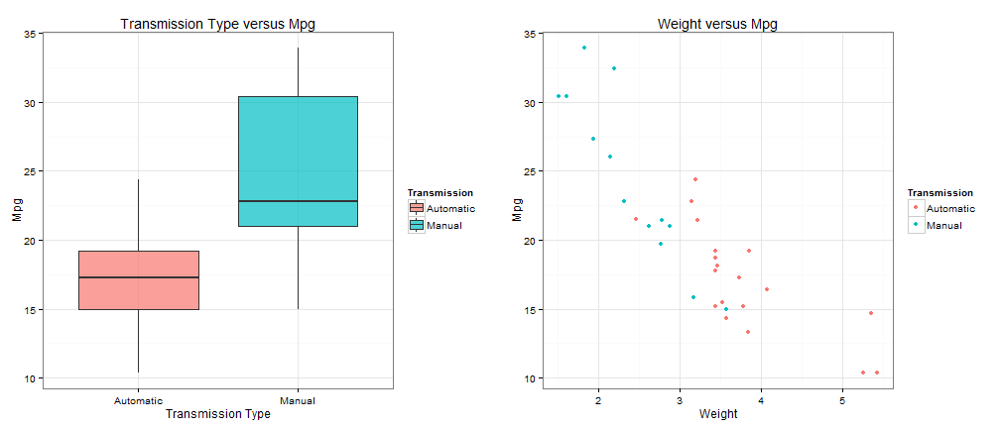
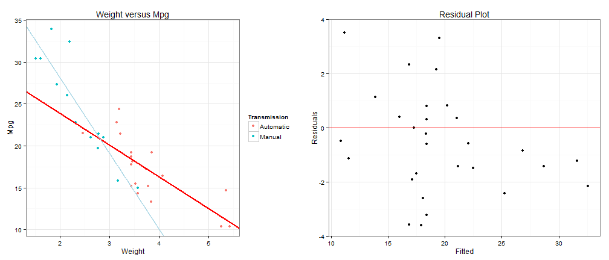

## Description
>This Slide details a simple linear prediction app at this [link](https://eason.shinyapps.io/mpgPrediction/). This simple app tried to predict the average mpg value given car weight and transmission type. You can open this link and tried to input weight value and select transmission type to see the predicted result.

### Basic Outline
1. Exploratory Analysis of Transmission and Weight's impact on mpg.
2. Building a simple linear regression model.
3. Visualize the fitted model.

--- .class #id 

## Exploratory Analysis
>From the below figures, we can easily detect a difference of mpg between different transmission type. And those manual type have larger mpg value than automatic. Also we can see clearly a linear relationship between car weight and mpg. Since those two variables are both related to mpg, we include them all in our model.




--- .class #id 

## Regresion Model
>Based on the summary, we can see that transmission type, weight and their iteraction all have very high siginificant values. And latter when we visualized the fitted lines, we should pay attention their different slopes and intercepts. Also from the summary, we can tell that manual transmission under normal condition is much fuel saving than automatic.


```r
fit1 <- lm(mpg ~ am * wt, data = mtcars)
summary(fit1)$coef
```

```
##             Estimate Std. Error t value  Pr(>|t|)
## (Intercept)   31.416     3.0201  10.402 4.001e-11
## am1           14.878     4.2640   3.489 1.621e-03
## wt            -3.786     0.7856  -4.819 4.551e-05
## am1:wt        -5.298     1.4447  -3.667 1.017e-03
```

--- .class #id 

## Model Visualization
>We can see that the two types of points fit well. And from the residuals plot, we observe most of the residuals centered around the 0 horizontal. Although this is not a perfect model, please visit [link](https://eason.shinyapps.io/mpgPrediction/) and try its prediction result! Please feel free add my [linkedIn](www.linkedin.com/in/yinsenm/). Thank you!!




